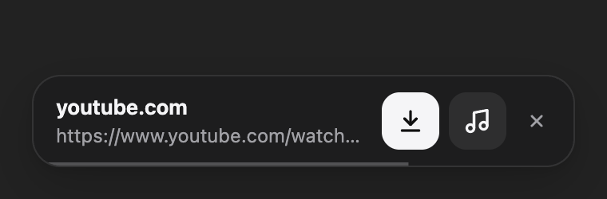
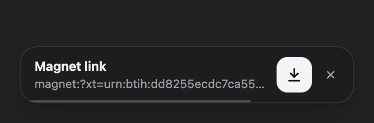

# Cobalt Downloader

> All available cobalt instances in your browser.

**Copy a video link, click download, done.** A free, open-source browser extension that notices when you copy a YouTube, TikTok, Instagram, X (Twitter), Reddit or other video link and downloads the video or just the audio in one click, through [cobalt](https://github.com/imputnet/cobalt). No ads, no sketchy downloader websites and no account needed.

Works in Chrome and every Chromium-based browser: [Helium](https://helium.computer), Brave, Edge, Arc, Vivaldi, Opera and others.

<p>
  
  
</p>

## Features

- **Copy to download:** Copy a video link from the address bar or a page and a small popup appears in that tab. If you don't use it, it disappears after 3 seconds.
- **Video or audio only:** Saves straight to your Downloads folder, in up to 4K quality or as audio only.
- **Always a working server:** Finds a working cobalt instance automatically. The live list comes from [cobalt.directory](https://cobalt.directory), and if one instance fails the next one is tried.
- **Works with Turnstile-protected instances:** When a link can only be downloaded on an instance that uses Cloudflare Turnstile, that instance's website opens with your link already filled in.
- **Optional [TorBox](https://torbox.app) support:** Downloads magnet links (torrents) and links from file hosts like Mega, 1fichier, Google Drive, MediaFire and Pixeldrain, and acts as a fallback when cobalt can't handle a video.
- **Private:** The clipboard is read locally and nothing leaves your browser until you click download. No analytics.

## Supported sites

YouTube (videos, Shorts, live), TikTok, Instagram (posts, reels, stories), X / Twitter, Reddit, Vimeo, SoundCloud, Twitch clips, Bilibili, Pinterest, Tumblr, Facebook, Dailymotion, Streamable, Bluesky, Loom, OK.ru, VK, Rutube, Snapchat, Xiaohongshu and Newgrounds. In short, everything [cobalt supports](https://github.com/imputnet/cobalt#supported-services).

With a TorBox key you also get magnet links and around 80 file hosts.

## Install

The extension isn't on the Chrome Web Store yet, so you install it from this repository:

1. Download the code with **Code → Download ZIP** and unzip it, or run:
   ```sh
   git clone https://github.com/ruzgarselvan/cobalt-downloader.git
   ```
2. Open `chrome://extensions` in your browser.
3. Turn on **Developer mode** in the top-right corner.
4. Click **Load unpacked** and select the folder.

To update, pull or download the latest code and press the reload button on the extension's card in `chrome://extensions`.

## How to use

- **Copy a link:** Copy a video link, then click the download button (or the music note for audio only) in the popup.
- **Toolbar icon:** Click the extension icon to download the video on the page you are looking at.
- **Turnstile fallback:** If no open instance can download the link, the popup offers **Open on …**. This opens a cobalt website with your link filled in, where the download works normally.

## How it works

cobalt is a media downloader with a public API, and people run their own copies of it called *instances*. [cobalt.directory](https://cobalt.directory) tracks which instances are online and which sites work on each.

The extension reads that list (refreshed every 6 hours) and sends your link to the best-scoring instances that don't require Cloudflare Turnstile. Turnstile is a bot check that can only be completed on an instance's own website, so a browser extension can't call those instances directly. Instead, it opens their website with the link already filled in.

## TorBox (optional)

If you have a [TorBox](https://torbox.app) subscription, paste your API key from torbox.app → Settings into the extension's options.

- **Magnet links and file-host links** go straight to TorBox. Torrents with several files are saved into their own folder.
- **Content TorBox hasn't cached yet** is fetched by TorBox first. The extension checks every 30 seconds and downloads it automatically when it's ready, then shows a notification.
- **Video links** still go to cobalt first. TorBox is only used when cobalt fails.

Your key is stored only in your browser's extension storage and is sent only to TorBox.

## Options

Right-click the extension icon → **Options**:

| Option | What it does |
| --- | --- |
| Detect copied video links | Turn clipboard detection on or off. The toolbar icon still works when it's off. |
| Video quality | Best available, or 2160p down to 360p (default 1080p). |
| Your own cobalt instance | Use only your self-hosted instance and skip cobalt.directory. |
| Instance API key | For instances that require an `Api-Key`. |
| TorBox API key | Turns on TorBox support. |

## Privacy

- **Local clipboard reading:** The extension reads the clipboard once a second inside the browser to spot links. What you copy is never stored or sent anywhere.
- **What leaves your browser:** A link is sent to a cobalt instance, or to TorBox, only when you click a download button.
- **Other network requests:** The only other requests are to cobalt.directory (the instance list) and to TorBox's public list of supported file hosts.
- **No tracking:** No analytics and no accounts.

## FAQ

**Why does a download sometimes fail?**
Community instances are run by volunteers, and sites like YouTube change often. The extension tries every open instance and then offers the website fallback. Adding a TorBox key gives you a paid, more reliable fallback.

**Why only a few instances? cobalt.directory lists many more.**
Most instances use Cloudflare Turnstile, which can only be solved on their own website. Those instances are used through the "Open on …" fallback instead.

**Does it work in Firefox or Safari?**
Not yet. It relies on Chromium's offscreen documents to read the clipboard.

**Is it safe?**
The whole extension is a few hundred lines of plain JavaScript in this repository, with no build step and no dependencies, so you can read exactly what it does.

**Can I use my own cobalt instance?**
Yes. Enter its URL (and API key, if any) in the options.

## Contributing

Issues and pull requests are welcome. If you spot an outdated site pattern or a broken instance parser, please open an issue.

## Credits and disclaimer

- **cobalt** is made by [imput](https://github.com/imputnet/cobalt).
- **cobalt.directory** is an unofficial instance tracker.
- **TorBox** is a separate paid service.

This project is not affiliated with any of them. Only download content you have the right to download, and respect each site's terms.

## License

[MIT](LICENSE)
